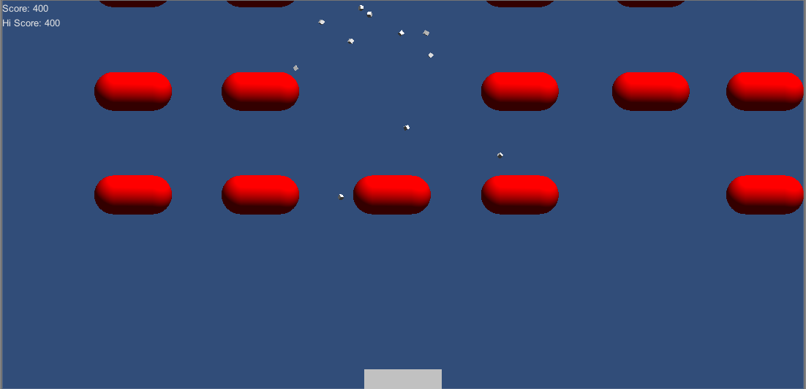

# Space Invaders
> A close recreation of the arcade video game created by Taito.

## Installation
Create a new Unity Project and then replace the Assets & Project Settings folders with the files from this repository in order to run this build.

## Instructions
Space Invaders was created in Unity3D and is a close recreation of the arcade video game created by Taito. The game can only be played by one Player and ends when the Player's character is destroyed.

* Created using Unity3D and used MonoDevelop for scripting
* Based on a tutorial provided by PushyPixels

## Meta
[Yamil Burgos](https://github.com/yamilburgos/) – yamil.burgos1293@gmail.com

## Contributing
1. Fork it (<https://github.com/yamilburgos/SpaceInvaders/fork>)
2. Create your feature branch (`git checkout -b feature/fooBar`)
3. Commit your changes (`git commit -am 'Add some fooBar'`)
4. Push to the branch (`git push origin feature/fooBar`)
5. Create a new Pull Request
